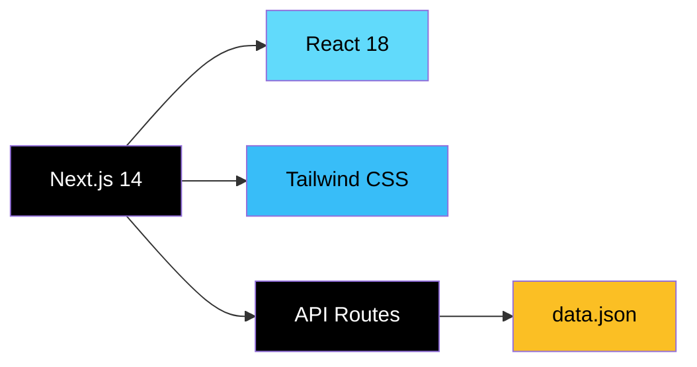

# 📱 Temp Number

> **Receive SMS online instantly — no registration, no hassle.**

Temp Number is a free, open‑source web application that provides temporary phone numbers for receiving SMS messages online. Built for developers, testers, and anyone who needs a disposable number for verification, testing, or privacy protection.

🔗 **Live Demo:** [https://temp-number.vercel.app](https://temp-number.vercel.app) *(sesuaikan dengan URL Anda)*

---

## ✨ Features

| Feature | Description |
|---------|-------------|
| **📞 Instant Numbers** | Get a temporary phone number in seconds — no sign‑up required |
| **📨 Real‑time SMS** | View incoming messages instantly as they arrive |
| **🌍 Multiple Countries** | Choose from numbers in various countries |
| **🔍 Smart Filtering** | Filter numbers by country and paginate through results |
| **📱 Responsive Design** | Works flawlessly on desktop, tablet, and mobile |
| **⚡ Blazing Fast** | Built on Next.js 14 with static data for near‑instant responses |
| **🛡️ Privacy First** | No personal data collected — numbers are public and shared |

---

## 🛠️ Tech Stack



- **Framework:** Next.js 14 (Pages Router)[reference:1]
- **Frontend:** React 18 + Tailwind CSS[reference:2]
- **Backend:** Next.js API Routes[reference:3]
- **Data:** Static `data.json` for local/dev use[reference:4]

---

## 📂 Project Structure

```
temp-number/
├── pages/
│   ├── index.js          # Main application page
│   ├── docs.js           # API documentation page
│   └── api/
│       ├── countries.js  # GET /api/countries
│       ├── numbers/
│       │   ├── index.js  # GET /api/numbers
│       │   └── [id].js   # GET /api/numbers/:id
│       └── messages/
│           └── [id].js   # GET /api/messages/:id
├── public/
│   └── docs.html         # Static API docs (fallback)
├── data.json             # All numbers, messages & countries
├── next.config.js
├── package.json
└── vercel.json
```

---

## 📡 API Endpoints

| Method | Endpoint | Description |
|--------|----------|-------------|
| `GET` | `/api/countries` | List all available countries with number counts[reference:5] |
| `GET` | `/api/numbers` | List numbers with pagination & country filter[reference:6] |
| `GET` | `/api/numbers/:id` | Get detailed info for a specific number[reference:7] |
| `GET` | `/api/messages/:id` | Get all inbox messages for a number[reference:8] |

### Example Response

```json
// GET /api/countries
[
  { "code": "US", "name": "United States", "count": 12 },
  { "code": "GB", "name": "United Kingdom", "count": 8 }
]

// GET /api/numbers?country=US&page=1&limit=10
{
  "data": [
    { "id": "1", "number": "+1 234 567 890", "country": "US", "messages": [...] }
  ],
  "pagination": { "page": 1, "limit": 10, "total": 12 }
}
```

---

## 🚀 Getting Started

### Prerequisites
- Node.js 18+ and npm/yarn/pnpm

### Installation

```bash
# 1. Clone the repository
git clone https://github.com/TheyanzXD/temp-number.git
cd temp-number

# 2. Install dependencies
npm install

# 3. Start development server
npm run dev
```

Open [http://localhost:3000](http://localhost:3000) to view the app.[reference:9]

---

## ☁️ Deploy to Vercel

The easiest way to deploy is using the **Vercel Platform**:

1. Push your code to a GitHub repository.
2. Import the repository in the [Vercel Dashboard](https://vercel.com/new).
3. Vercel will auto‑detect Next.js and handle the build.[reference:10]

[](https://vercel.com/new/clone?repository-url=https://github.com/TheyanzXD/temp-number)

---

## ⚠️ Important Notes

> **For development and testing purposes only.**[reference:11]

- 📌 All numbers are **public and shared** — messages are visible to everyone.
- 🔒 **Do not** use for sensitive communications, banking, or personal accounts.
- 🧪 Ideal for testing app integrations, QA, and demo purposes.

---

## 🤝 Contributing

Contributions are welcome! Feel free to:

- 🐛 Report bugs via [Issues](https://github.com/TheyanzXD/temp-number/issues)
- 💡 Suggest features
- 🔧 Submit pull requests

Please read our [Contributing Guidelines](CONTRIBUTING.md) before submitting.

---

## 📄 License

This project is licensed under the **MIT License** — see the [LICENSE](LICENSE) file for details.

---

## 🙏 Acknowledgements

- Built with [Next.js](https://nextjs.org)
- Styled with [Tailwind CSS](https://tailwindcss.com)
- Icons by [Heroicons](https://heroicons.com) & [Font Awesome](https://fontawesome.com)

---

**Made with ❤️ by [TheyanzXD](https://github.com/TheyanzXD)**
